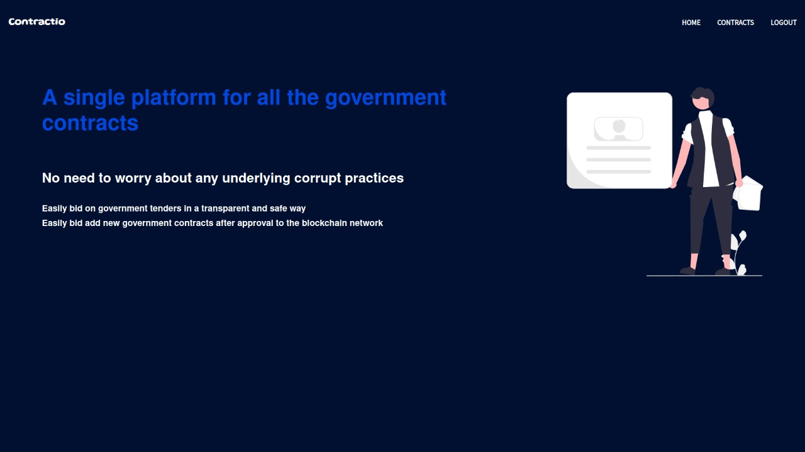
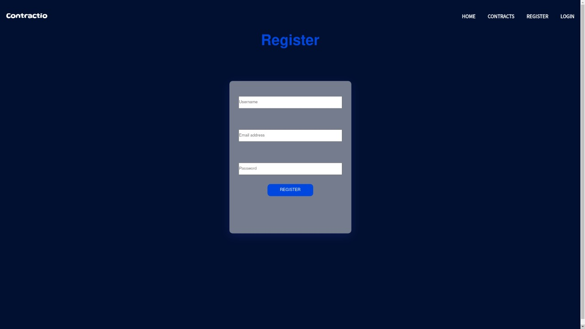
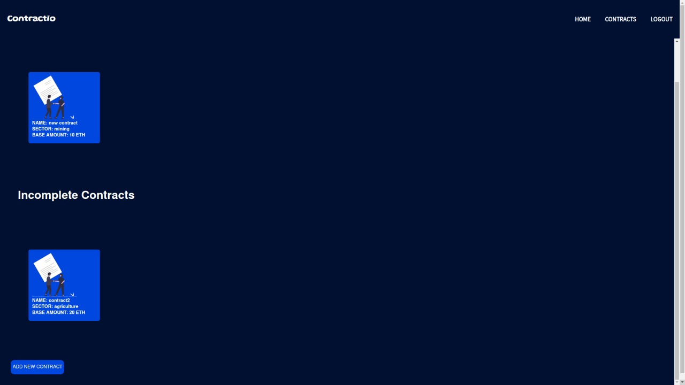
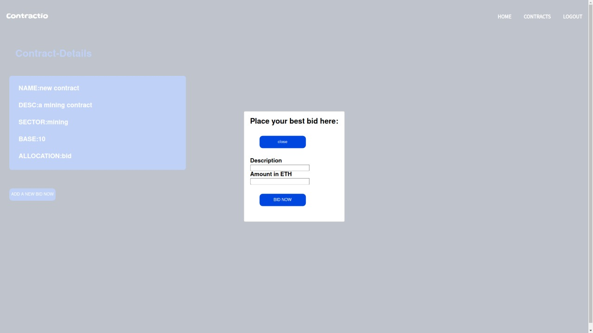

<h1 align="center">
  <br>
CONTRACTIO
  <br>
</h1>

<h3 align="center">A single platform for  all the Government Contracts.</h3>

# FRONTEND

<p>                               
 
  
   </p>

# Description
It is a web-platform with frontend and UI managed by ReactJs and backend managed by Nodejs where the government user can log their contracts to the blockchain network which makes it immutable and the bidders can view the contract, submit their bids and when the government approves any bid that particular bidder successfully acquires the contract.

# Tech Stacks Used
 * Solidity
 * Ganache
 * Metamask
 * Truffle
 * Backend: Nodejs
 * Frontend: ReactJs

# Features
* Every user, the government or the bidder register on the platform.
* The government adds a contract after approval with all the details to the blockchain network.
* The bidder can see the contract and add his bid, if interested.
* The government reviews the bid and approves it if the bid is mutually profitable.
* The bidder then gets assigned to the contract and can start working on the contract.

# Installation and Setup 

* ### Clone the repository 
```Bash
git clone https://github.com/deucaleon18/TREKTHEHILL-FULL-SLACK-DEVELOPERS && cd TREKTHEHILL-FULL-SLACK-DEVELOPERS
```

* ### Install dependencies
```
All the prerequisites for this project like Ganache, Metamask and Truffle should be installed.Detailed installation instructions could be found in the `resources` folder.
```

* ### Migrate the blockchain to the Ganache network.
  ```
  cd TREKTHEHILL-FULL-SLACK-DEVELOPERS
  truffle migrate --reset
  ```

* ### Install all the dependancies and start the client.

  ```
  cd client 
  npm install 
  npm start
  ```